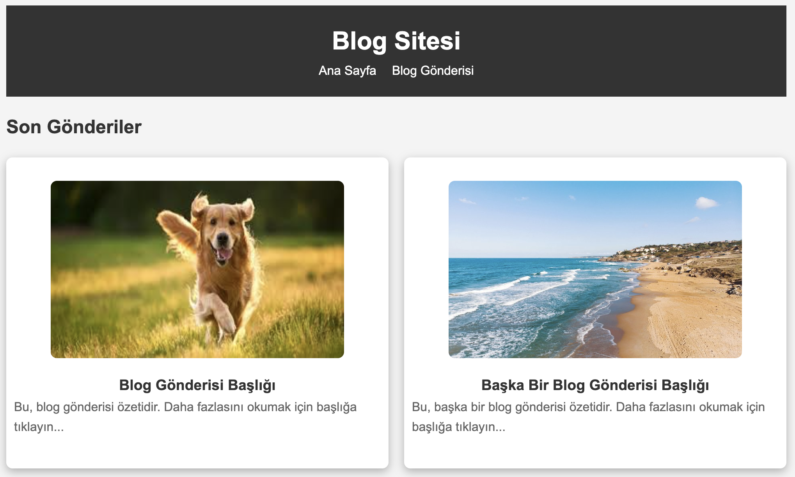

# Simple Blog Website

This project is a simple blog website built with **HTML** and **CSS**.  
It contains a **home page** and a **blog post page**.

---

## 📂 File Structure

- `index.html` → Home page  
- `post.html` → Blog post page  
- `styles.css` → Stylesheet  

---
## Preview

---

## 🖥️ Features

### Home Page (index.html)
- A main heading (`<h1>`)
- Navigation menu (`<nav>` with `<ul>`)
- At least two blog post previews (`<article>`)  
  - Previews are displayed as white background **cards** with rounded corners and shadow effect.  
  - Each preview contains a link to the related blog post.  
- Footer (`<footer>`) with copyright information.

### Blog Post Page (post.html)
- A main heading (`<h1>`)
- Navigation menu (`<nav>`)
- Blog content (`<article>` and `
`)
- Footer with copyright information.

---

## 🎨 Visual Requirements

- **Background**: `#f4f4f4`  
- **Header & Footer**: `#333` (dark gray)  
- **Text**: Headings `#333`, paragraphs `#666`  
- **Font**: Arial, sans-serif  
- **Cards**:  
  - White background  
  - Rounded corners using `border-radius`  
  - Shadow effect using `box-shadow`  
  - `margin` for spacing between cards, `padding` for inner spacing  

---

## 🚀 Usage

1. Download the project files.
2. Make sure all files are in the same folder:  
   - `index.html`  
   - `post.html`  
   - `styles.css`  
3. Open `index.html` in your web browser to view the project.  

---

## 📜 Copyright

© 2025 - Simple Blog Website. All rights reserved.
