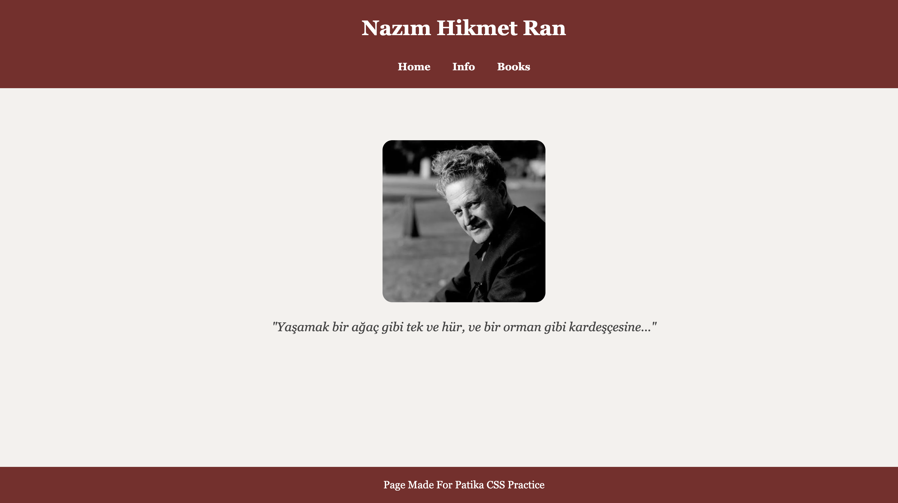

# Tribute Website - Nazım Hikmet Ran

This project is a **tribute website** created as part of an assignment.  
It is dedicated to the famous Turkish poet **Nazım Hikmet Ran**.  
The website consists of multiple pages and includes information about his life, works, and a famous quote.  

---

## 📑 Pages
- **Home (index.html)** → Hero section with an image and a quote  
- **Biography (bio.html)** → Information about Nazım Hikmet’s life and career  
- **Works (books.html)** → List of his major works  

---

## 🎨 Design
- The design uses **HTML5 and CSS3**.  
- CSS Flexbox is used to keep the footer always at the bottom.  
- The layout includes:
  - A header with navigation
  - A hero section with image + quote
  - Biography and works sections
  - A footer with the assignment credit  

---

## 🖼️ Preview

---

## ⚙️ How to Run
1. Clone or download the repository.  
2. Open `index.html` in your browser.  
3. Use the navigation bar to move between **Home**, **Info**, and **Books** pages.  

---

## 📌 Assignment Note
**Page Made For Patice CSS Practice**  

