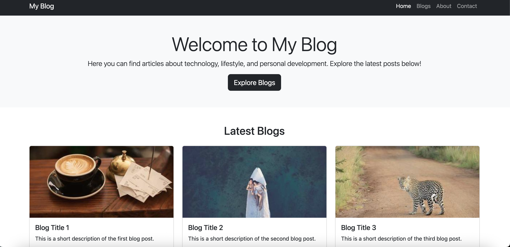

# Blog Website Project

This project is a simple **blog website** built with **Bootstrap 5**.  
It was created as a practice assignment to explore Bootstrap components and responsive design.

---

## ✨ Features
- **Navbar**: Dark, responsive navigation bar (collapses into a hamburger menu on mobile).
- **Jumbotron**: A welcoming section on the homepage with a brief description.
- **Blog Cards**: Blog posts are displayed using Bootstrap cards inside a grid system.
- **Responsive Design**: Works smoothly across desktop, tablet, and mobile devices.
- **Footer**: Simple dark footer section.

---

## 🛠 Technologies Used
- **HTML5**
- **CSS3**
- **Bootstrap 5**

---

## 🚀 How to Run
1. Clone or download the project files.
2. Open `index.html` in your browser.
3. The blog page will load automatically.

---

## 📸 Screenshot
Here is a sample screenshot of the homepage layout:

---

## 📖 Learning Outcomes
- Gained hands-on experience with Bootstrap grid system.
- Learned how to use components like **Navbar**, **Cards**, and **Jumbotron**.
- Practiced building a **responsive layout** with Bootstrap utilities.

---

